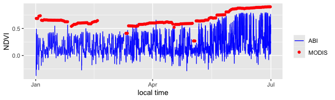

GeoNEXTools

================
Hirofumi Hashimoto
14 April 2024

<!-- README.md is generated from README.Rmd. Please edit that file -->
<!-- badges: start -->

[](https://lifecycle.r-lib.org/articles/stages.html)
[](https://github.com/r-lib/rcmdcheck/actions/workflows/R-CMD-check.yaml)
<!-- badges: end -->

The goal of GeoNEXTools is to help download GeoNEX subset dataset. Most
of the GeoNEXTools functions are compatible with
[MODISTools](https://github.com/ropensci/MODISTools) for ease to users
who are familiar with
[MODISTools](https://github.com/ropensci/MODISTools).

## Installation

You can install the development version of GeoNEXTools from
[GitHub](https://github.com/) with:

``` r
# install.packages("devtools")
devtools::install_github("GeoNEX-Community-Tools/GeoNEXTools")
```

## Example

This is a basic example which shows you how to solve a common problem:

#### Load GeoNEXTools library

``` r
library(GeoNEXTools)
```

#### Find the product names

gt_products will show the product names:

``` r
products <- gt_products()
print(products)
#>           product             description
#> 1 geonex_GO16_L1G GeoNEX GOES-16 L1G Grid
#> 2 geonex_GO16_L2G  GeoNEX GOES-16 L2 Grid
```

#### Find the name of bands

gt_bands will show the bands for each product:

``` r
bands <- gt_bands(product = "geonex_GO16_L1G")
head(bands)
#>     band                                                  description
#> 1 BAND01 GOES16 GEONEX geonex_GO16_L1G product TOA band 1 reflectance
#> 2 BAND02 GOES16 GEONEX geonex_GO16_L1G product TOA band 2 reflectance
#> 3 BAND03 GOES16 GEONEX geonex_GO16_L1G product TOA band 3 reflectance
#> 4 BAND04 GOES16 GEONEX geonex_GO16_L1G product TOA band 4 reflectance
#> 5 BAND05 GOES16 GEONEX geonex_GO16_L1G product TOA band 5 reflectance
#> 6 BAND06 GOES16 GEONEX geonex_GO16_L1G product TOA band 6 reflectance
#>   reoslution_degrees
#> 1               0.01
#> 2              0.005
#> 3               0.01
#> 4               0.02
#> 5               0.01
#> 6               0.02
```

#### List site names

gt_sites will show the list of the site names. The site names are same
with [MODIS subset fixed sites](https://modis.ornl.gov/sites/):

``` r
sites <- gt_sites()
head(sites)
#>                                       siteid
#> 1 ar_buenos_aires_carlos_casares_agriculture
#> 2   ar_buenos_aires_carlos_casares_grassland
#> 3                   ar_buenosaires_ceilap-ba
#> 4          ar_buenosaires_celpa_mar_chiquita
#> 5                  ar_chubut_ceilap_comodoro
#> 6                           ar_chubut_trelew
#>                                     sitename   network  latitude longitude
#> 1 AR Buenos Aires Carlos Casares agriculture AMERIFLUX -35.62100 -61.31810
#> 2   AR Buenos Aires Carlos Casares grassland AMERIFLUX -35.92440 -61.18550
#> 3                  AR Buenos Aires CEILAP-BA   AERONET -34.55542 -58.50641
#> 4         AR Buenos Aires CELPA Mar Chiquita AMERIFLUX -37.70280 -57.41920
#> 5                  AR Chubut CEILAP Comodoro   AERONET -45.79215 -67.46287
#> 6                           AR Chubut Trelew   AERONET -43.24981 -65.30861
#>          state   country
#> 1 Buenos Aires Argentina
#> 2 Buenos Aires Argentina
#> 3 Buenos Aires Argentina
#> 4 Buenos Aires Argentina
#> 5       Chubut Argentina
#> 6       Chubut Argentina
```

#### Find site names in a specified bounding box.

The number of sites is more than 1000. The sites can be filtered by
latitude and longitude.

``` r
north <- 37.5
south <- 37
west <- -122.5
east <- -122
print(sites[which(sites$latitude < north & sites$latitude > south
                  & sites$longitude < east & sites$longitude > west),])
#>                           siteid                     sitename   network
#> 471   us_california_jasper_ridge   US California Jasper Ridge  PHENOCAM
#> 489      us_california_nasa_ames      US California NASA Ames   AERONET
#> 544 us_california_uca_santa_cruz US California UCA Santa Cruz FORESTGEO
#>     latitude longitude      state                  country
#> 471 37.40213  -122.221 California United States of America
#> 489 37.41999  -122.057 California United States of America
#> 544 37.01240  -122.075 California United States of America
```

#### Find a site names from AmeriFlux ID.

The site name can be also found by AmeriFlux ID.

``` r
AMF_ID <- "US-Ha1"
AMF_tz<-"America/New_York"
AMF_sites <- gt_sites(network="AMERIFLUX")
US_Ha1 <- AMF_sites[which(AMF_sites$network_siteid == AMF_ID),]
print(US_Ha1)
#>     network_siteid                network_sitename
#> 227         US-Ha1 Harvard Forest EMS Tower (HFR1)
#>                                     network_siteurl   network latitude
#> 227 https://ameriflux.lbl.gov/sites/siteinfo/US-Ha1 AMERIFLUX  42.5378
#>     longitude                          siteid
#> 227  -72.1715 us_massachusetts_harvard_forest
```

#### Retrieve GOES time-series data

gt_subset will retrieve the time-series data for specific band, date,
and site ID.

``` r
start_date <- "2019-01-01"
end_date <- "2019-06-30"
GOES_band2 <- gt_subset(product = "geonex_GO16_L1G",
                         band = "BAND02",
                         start = start_date,
                         end = end_date,
                         site_id = US_Ha1$siteid,
                         internal = TRUE)
band2_G <- GOES_band2$value
band2_G[band2_G <= 0 | band2_G > 1] <- NA

GOES_band3 <- gt_subset(product = "geonex_GO16_L1G",
                         band = "BAND03",
                         start = start_date,
                         end = end_date,
                         site_id = US_Ha1$siteid,
                         internal = TRUE)
band3_G <- GOES_band3$value
band3_G[band3_G <= 0 | band3_G > 1] <- NA

t_G <- as.POSIXlt(GOES_band3$calendar_date, 
                tz="GMT", 
                format="%Y%m%dT%H%M")
NDVI_G <- (band3_G-band2_G)/(band3_G+band2_G)
```

#### Retrieve MODIS time-series data using MODISTools

``` r
library(MODISTools)

MODIS_band1 <- mt_subset(product = "MCD43A4",
                    band = "Nadir_Reflectance_Band1",
                    start = start_date,
                    end = end_date,
                    site_id = US_Ha1$siteid,
                    internal = TRUE,
                    progress = FALSE
                    )
MODIS_band1 <- subset(MODIS_band1,
                      pixel==(as.numeric(max(MODIS_band1$pixel))+1)/2)
band1_M <- MODIS_band1$value
band1_M[band1_M==MODIS_band1$fill_value[1]] <- NA
band1_M <- band1_M*as.numeric(MODIS_band1$scale[1])
band1_M[band1_M <= 0 | band1_M > 1] <- NA

MODIS_band2 <- mt_subset(product = "MCD43A4",
                    band = "Nadir_Reflectance_Band2",
                    start = start_date,
                    end = end_date,
                    site_id = US_Ha1$siteid,
                    internal = TRUE,
                    progress = FALSE
                    )
MODIS_band2 <- subset(MODIS_band2,
                      pixel==(as.numeric(max(MODIS_band2$pixel))+1)/2)
band2_M <- MODIS_band2$value
band2_M[band2_M==MODIS_band2$fill_value[1]] <- NA
band2_M <- band2_M*as.numeric(MODIS_band2$scale[1])
band2_M[band2_M <= 0 | band2_M > 1] <- NA

t_M <- as.POSIXlt(MODIS_band1$calendar_date, 
                tz=AMF_tz,
                format="%Y-%m-%d") + 12*60*60

NDVI_M  <- (band2_M-band1_M)/(band2_M+band1_M)
```

#### Show time-series data

The following is an example plot of the time-series of the data

``` r
library(ggplot2)
library(lubridate, warn.conflicts = FALSE)

df_GOES <- data.frame(timestamp=with_tz(t_G,tzone = AMF_tz),
                   NDVI=NDVI_G)

df_MODIS <- data.frame(timestamp=t_M,NDVI=NDVI_M)

ggplot() +
      geom_line(data = df_GOES, aes(x=timestamp, y=NDVI, color="blue"),  na.rm=TRUE) +
      geom_point(data = df_MODIS, aes(x=timestamp, y=NDVI, color="red"), na.rm=TRUE) +
      scale_color_manual(values = c("blue","red"), labels = c("ABI","MODIS"), name = "") +
      xlab("local time") +
      ylab("NDVI")
```



### References

Koen Hufkens. (2023). bluegreen-labs/MODISTools: MODISTools v1.1.5.
Zenodo. <https://doi.org/10.5281/zenodo.7551164>

Weile Wang, et al., (2020). An Introduction to the Geostationary-NASA
Earth Exchange (GeoNEX) Products: 1. Top-of-Atmosphere Reflectance and
Brightness Temperature, Remote Sensing, 12(8), 1267.

### Acknowledgements

We would like to express gratitude to Dr. Koen Hufkens (BlueGreen Labs
(bv)) for kindly allowing us to reuse his code in MODIS subsetTools to
develop GeoNEXTools.
